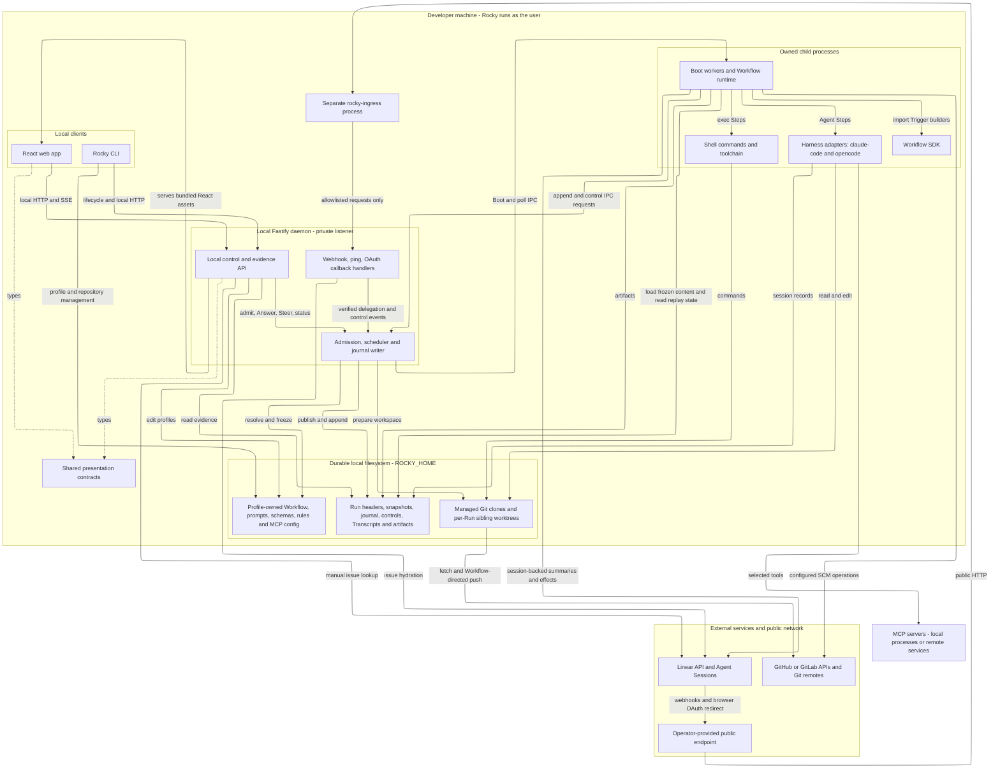
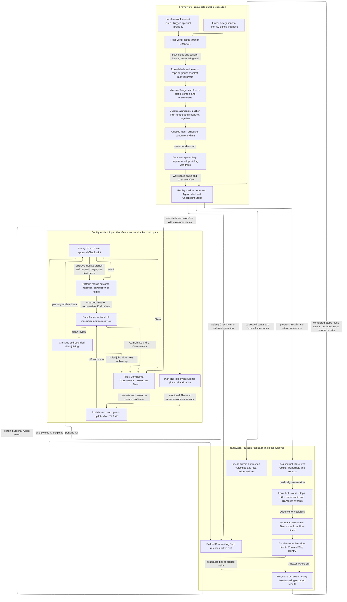

# Rocky Architecture And Dataflow

## Scope

These two diagrams cover only the Rocky monorepo available in
`agent-rocky-reviewer`: `packages/cli`, `apps/web`, `packages/daemon`,
`packages/local-contracts`, `packages/sdk`, and shipped Workflow content.
No additional Niotix repository was inspected or inferred from `niotix-all`.
External services below are implemented integration boundaries, not a claim of
verified live connectivity or coverage of their internal architecture.

Source inspection for NG-692 used base commit `4d7e840` and the existing working
tree, including its uncommitted profile membership and local-product work.
That prior work is preserved, not included in this documentation commit.
Current production composition takes precedence over historical repo-owned
`.rocky/` descriptions in the README and older design notes.

## Architecture

Solid arrows are runtime calls, transport, or filesystem access. Dotted arrows
are **type-only** imports, not network communication. A Boot is one execution
or poll/replay pass over a Run; its worker is a child process, not the HTTP
server's event loop. The SDK provides types and runtime Trigger builders;
the daemon supplies Workflow behavior.

Use a Mermaid renderer with ELK layout support (validated with Mermaid CLI
11.17.0). Open the rendered diagrams at full size or zoom to read the boundary
crossings; narrow Markdown previews necessarily shrink this overview.

**Ingress isolation:** the separate filter forwards only exact
`POST /api/linear/webhook`, exact `GET /api/ping`, and
`GET /api/linear/oauth/callback` (with an optional query). Other targets return
404; forwarded headers are restricted and GET bodies are discarded. Webhook
signature verification and OAuth state handling remain daemon responsibilities.
The default daemon binding is `127.0.0.1:7625`, but binding is configurable and
the local API has no authentication. Never tunnel that listener: the filter does
not make a separately exposed daemon safe. See [public endpoint](public-endpoint.md).

**Ownership:** local `profiles/<id>.json` and `<id>.workflow.ts` own execution
configuration. Production admission ignores target-repository `.rocky/` content.
Explicit profile membership is authoritative; the first member is the lead for
default SCM operations. Agents receive the shared workspace parent, containing
one worktree per member. Shipped shell helpers target `ROCKY_LEAD_REPO`.
MCP declarations are frozen, while credentials and environment values are
resolved locally at runtime. MCP placement depends on its transport; it is not
necessarily hosted by Rocky. See [MCP](mcp.md) and [Harnesses](harnesses.md).

## Dataflow

The top section is framework admission/execution. The middle section is
**configurable shipped Workflow behavior**, not a mandatory pipeline. The last
section shows feedback and evidence shared across Steps. Arrows carry the named
data or control signal; the chart does not imply every Run reaches every node.

**Admission and replay:** one live Run per issue is enforced before preparation;
duplicate delegations reuse/nudge that Run, while conflicting manual requests
are refused. Preparation failure does not publish a partial Run. The frozen
header includes issue, Trigger, profile and member URLs/base branches; it is not
a promise that all repository contents remain fixed at admission. Worktrees
adopt retained or upstream issue branches without resetting prior work.
Profile edits affect future Runs, not an admitted Run's snapshot.

A new Boot re-executes ordinary TypeScript from the top. Completed journaled
Steps normally return recorded results; interrupted effects can execute again,
and background shell Steps restart on working Boots, not polls. Workflows must
keep side effects inside appropriate Steps and account for at-least-once
execution. Divergence and crash-loop checks can fail a Run. Parking releases a
scheduler slot, not necessarily the worker process or its worktree.

**Inputs and evidence:** Agent calls combine frozen prompts, structured input,
tool/MCP selection and a result schema. Validated results feed later Steps;
shell Steps return exit code/stdout/stderr. Session records are Transcripts,
kept locally alongside screenshots and other Run artifacts. The local API
projects journal state and streams evidence; Linear receives summaries and
localhost links, not raw Transcript chunks. This is a Rocky mirroring rule, not
a claim that Harness providers or remote MCP tools never receive Agent inputs.
Artifact retention can prune evidence after a Run ends.

**Limits and Workflow choices:** the shipped main Workflow pushes and opens a
draft before its review/fix and CI loops, then requests approval. Only configured
Workflow code requests platform merge; SCM adapters enforce their supported
head/approval/protection checks. A clean review or successful Run is not by itself
proof of a merged PR. UI inspection requires configured commands and MCP tools.
In the inspected shipped main Workflow, `armAutoMerge(pr)` does not pass the
approved Checkpoint capability required by `scm/context.ts`. That call is refused
as `not_approved`; the diagram shows the requested SCM boundary, not a verified
automatic merge path. Correctly authored Workflows must pass the approval value.
The separate shipped `address-pr-conversations` Trigger reads unresolved SCM
threads, fixes, pushes and replies; it is not an automatic SCM webhook intake.

Local manual requests still resolve a Linear issue, but do not acquire an Agent
Session. Current production wiring enables Linear mirroring, SCM services,
preflight, and session-owned Answers/Steers only for session-backed Runs.
Consequently the shipped SCM-dependent conversation Workflow is not an
end-to-end supported local-manual path merely because its Trigger is listed.
Custom local-only Workflows can run Agents and shell Steps without those
services. No live Linear, SCM, Harness or MCP integration was exercised for this
documentation. See [local product](local-product.md), [execution integration](execution-integration.md)
and [run runtime](run-runtime.md) for more detail, subject to the source scope above.

## Source Map

Paths below are relative to the repository root. Tests exercise public seams
rather than treating older architectural prose as implementation evidence.

| Concern | Implementation | Relevant behavior tests |
| --- | --- | --- |
| Public boundary | `packages/cli/src/public-ingress.ts`; `packages/daemon/src/server.ts` | `packages/cli/src/public-ingress.spec.ts`; `packages/daemon/src/linear/webhook.spec.ts` |
| Production intake and manual limits | `packages/daemon/src/lifecycle/production-composition.ts`; `packages/daemon/src/run/production.ts` | `packages/daemon/src/run/execution-request.spec.ts`; `packages/daemon/src/run/production.spec.ts` |
| Profile ownership and membership | `packages/daemon/src/config/profiles.ts`; `packages/daemon/src/config/routing.ts`; `packages/daemon/src/run/snapshot.ts`; `packages/daemon/src/run/execution.ts` | `packages/daemon/src/run/execution-default-preparation.spec.ts`; `packages/daemon/src/run/multi-profile.spec.ts` |
| Admission, workspaces and replay | `packages/daemon/src/run/scheduler.ts`; `packages/daemon/src/run/worker.ts`; `packages/daemon/src/run/replay.ts`; `packages/daemon/src/repos/workspace.ts` | `packages/daemon/src/run/admission.spec.ts`; `packages/daemon/src/run/replay.spec.ts`; `packages/daemon/src/run/worker.spec.ts`; `packages/daemon/src/repos/workspace.spec.ts` |
| Controls and local evidence | `packages/daemon/src/local-api/index.ts`; `packages/daemon/src/local-api/artifacts.ts`; `packages/daemon/src/linear/control.ts`; `packages/daemon/src/linear/mirror.ts` | `packages/daemon/src/local-api/api.spec.ts`; `packages/daemon/src/linear/control.spec.ts`; `packages/daemon/src/linear/mirror.spec.ts`; `packages/daemon/src/run/agent-durability.spec.ts` |
| Configurable pipeline and SCM | `packages/daemon/content/.rocky/workflow.ts`; `packages/daemon/src/scm/context.ts` | `packages/daemon/src/scm/context.spec.ts`; `packages/daemon/src/scm/safety.spec.ts` |
