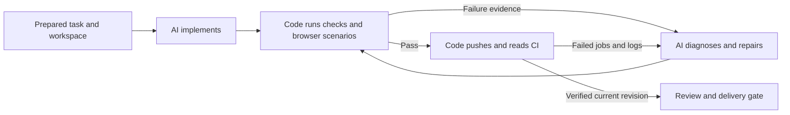
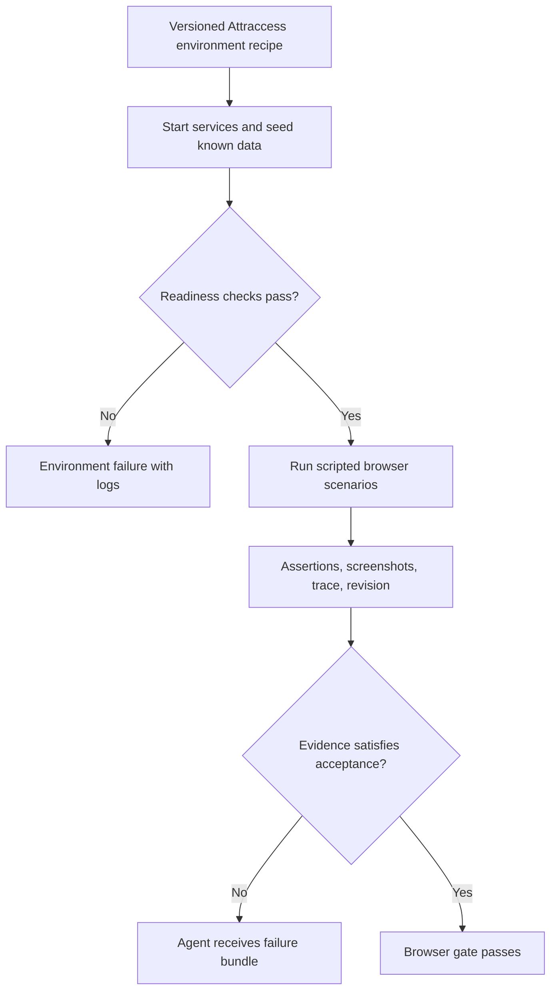

# Software factory patterns for an Attraccess-first Rocky rebuild

Research snapshot: **27 September 2026**. Primary sources only. This is architectural research, not a claim that any surveyed system has been tested against Attraccess. Recommendations below are proposals; they do not describe capabilities already verified in Rocky.

## The useful common idea

**Build a reliable development environment and a small, explicit delivery process. Give an agent the uncertain engineering work inside that process.**

The closest fit is Stripe's combination of deterministic operations and bounded coding agents. A graph editor is incidental: the important boundary is between decisions software can enforce and decisions that require engineering judgment.

This diagram is our proposed synthesis, not a reproduction of another product. The retry path needs explicit budgets and an escalation outcome.

## Seven patterns worth borrowing

### 1. Stripe Minions: deterministic work stays deterministic

**Evidence:** A first-party description of an internal production system, not an available implementation or an independently measured success rate. Stripe describes code-defined blueprints that alternate agent work, such as implementation and CI repair, with ordinary code for linting and pushing. Agents run in standardized isolated developer environments. CI failures without automatic fixes return to an agent; after a second push and CI round the branch returns to its human operator. [Stripe, Minions Part 2](https://stripe.dev/blog/minions-stripes-one-shot-end-to-end-coding-agents-part-2)

**Copy:** One standard Attraccess workflow. Code owns setup, checks, publication and evidence; agents implement and repair.

**Avoid:** Copying Stripe's infrastructure scale or retry limit without evaluation. A branch needing human repair remains incomplete.

### 2. OpenAI Symphony: keep the coordinator small

**Evidence:** Public specification and reference implementation. The specification separates scheduling, issue tracking, workspace management, agent execution, and observability; a versioned `WORKFLOW.md` holds configuration and prompt policy. It explicitly allows success at a handoff state rather than `Done`; tracker writes are typically performed by the agent. [Symphony specification](https://github.com/openai/symphony/blob/main/SPEC.md)

OpenAI describes Symphony as a minimal reference implementation and says it does not intend to maintain it as a standalone product. [OpenAI introduction](https://openai.com/index/open-source-codex-orchestration-symphony/)

**Copy:** Clear module boundaries, one isolated workspace per task, reconciliation against current tracker state, and a compact operational view. Keep prompts in readable versioned text.

**Avoid:** Treating a successful agent session or handoff as successful delivery. For this rebuild, coordinator-owned GitHub and Linear operations should enforce exact states and store receipts. Adopting Symphony wholesale would not establish browser readiness, CI recovery, or Attraccess acceptance.

### 3. OpenAI harness engineering: invest in the repository

**Evidence:** First-party account of one internal product. OpenAI describes making application behavior observable to agents, storing knowledge in the repository, and enforcing architectural constraints with linters and structural tests. It explicitly warns that its end-to-end autonomy depends on that repository's tooling and structure and should not be assumed to generalize. [Harness engineering](https://openai.com/index/harness-engineering/)

**Copy:** Treat repeated agent confusion as a missing interface or missing evidence. Give Attraccess concise architecture guidance, executable setup, discoverable validation commands, useful error messages, and access to application logs and browser evidence.

**Avoid:** Copying its relaxed merge philosophy. Attraccess's actual protection rules and required checks remain authoritative. Improving the harness should reduce repeated failure, not redefine failed checks as acceptable.

### 4. Anthropic long-running harnesses: progress needs durable evidence

**Evidence:** Published experiments and accompanying examples. Anthropic describes premature completion, oversized tasks, and lost context; its harness uses initialization, explicit feature lists, incremental work, progress notes, and browser verification. It acknowledges browser-tool and vision limitations and does not establish a universally best agent architecture. [Effective harnesses for long-running agents](https://www.anthropic.com/engineering/effective-harnesses-for-long-running-agents)

**Copy:** Small acceptance criteria, a baseline smoke test before editing, and a structured handoff after interruption. Separate the task's requirements from an agent's confidence that it has finished.

**Avoid:** Asking an initializer agent to rediscover known Attraccess setup on every run. Build the recurring setup once as code. A progress file is useful context, but cannot be the authority that a test passed or an external write succeeded.

### 5. StrongDM: validate real scenarios independently

**Evidence:** First-party account and methodology. StrongDM describes external holdout scenarios to reduce tests being rewritten to fit broken code, and behavioral replicas of third-party services for high-volume testing and failure simulation. Its no-human-review approach and success claims are the author's operating thesis, not independently validated outcomes for Attraccess. [StrongDM Software Factory](https://factory.strongdm.ai/)

**Copy:** Maintain a small set of acceptance scenarios independently from the implementation attempt. Reproduce known integration failures in controlled fixtures: expired credentials, missing permissions, duplicate events, failed CI jobs, unavailable services, and changed PR heads.

**Avoid:** Building a universe of service clones before one delivery works. Start with the few boundaries that have actually failed. Keep deterministic assertions for observable application behavior; reserve model judgment for subjective UX findings. Do not replace all tests or human review with an LLM judge.

### 6. OpenHands: separate conversation state from execution infrastructure

**Evidence:** Public SDK documentation and source. OpenHands documents saved conversation state plus an incremental event log, including tool results and agent configuration. Its remote agent-server architecture separates the client from isolated execution. [Conversation persistence](https://docs.openhands.dev/sdk/guides/convo-persistence), [remote execution overview](https://docs.openhands.dev/sdk/guides/agent-server/overview), [state implementation](https://github.com/OpenHands/software-agent-sdk/blob/main/openhands-sdk/openhands/sdk/conversation/state.py)

**Copy:** A replaceable agent-runner interface, structured events, and resumable conversations attached to a known workspace. The delivery coordinator should not depend on the UI being connected.

**Avoid:** Mistaking restored conversation history for restored real-world state. A restarted process still needs to check whether its server, checkout, browser authentication, and GitHub revision remain valid. SDK adoption alone does not provide a complete issue-to-merge system.

### 7. Temporal: replay is a contract, not an implementation detail

**Evidence:** Documented workflow semantics. Temporal requires deterministic orchestration and puts external calls, including LLM calls, in Activities. Existing event histories constrain changing command order; code changes need a versioning or patching strategy. [Workflow definition and versioning](https://docs.temporal.io/workflow-definition)

**Copy:** Distinguish orchestration from effects. Give each run a workflow version; persist external observations and effect receipts. Test crashes around pushes, PR creation, status publication, and agent completion. Test old histories before changing step order.

**Avoid:** Assuming a workflow engine makes an external write exactly-once. Rocky still needs stable operation identities and reconciliation when a request succeeds but its response is lost. Choose Temporal only if its operational cost beats a small, well-tested durable state machine; adopting an engine is not a substitute for defining those semantics.

## Browser automation: a concrete boundary

Playwright already supports isolated browser contexts, reusable authenticated state, setup projects, and separate accounts for parallel tests that mutate server state. It also supports managed web-server startup and trace inspection. These are ordinary automation capabilities, not tasks that require fresh model reasoning. [Authentication](https://playwright.dev/docs/auth), [web-server lifecycle](https://playwright.dev/docs/test-webserver), [trace viewer](https://playwright.dev/docs/trace-viewer)

For Attraccess, the proposed division is:

| Code owns | AI owns |
| --- | --- |
| Known checkout, app revision, ports, and service health | Understand the requested behavior |
| Seeded users, roles, resources, and permissions | Design a new acceptance scenario when required |
| Authentication and clean browser contexts | Inspect an unfamiliar failure using traces and logs |
| Existing navigation and regression scenarios | Implement or repair application code |
| Assertions, reload checks, screenshots, traces, exit status | Review usability and explain discrepancies |
| Evidence manifest tied to commit and fixture version | Propose reusable improvements to the harness |

An AI may author a new Playwright test. Once accepted, that test should execute deterministically. An exploratory browser session can discover a bug; it should not become the only repeatable proof that the bug is fixed.

## What this means for the rebuild

These are design recommendations inferred from the sources above, not claims of demonstrated Rocky reliability.

| Decision | Recommended first version | Generalize only after |
| --- | --- | --- |
| Workflow definition | One typed, code-defined state machine; readable prompt files | Multiple successful tasks expose a real second workflow |
| Repository support | One Attraccess adapter with setup, validation, fixtures, and integration mappings | Another repository needs the same stable contracts |
| Configuration | Credentials, concurrency, budgets, environment settings, delivery policy | A repeated operator need justifies another option |
| Agent roles | Implementer, evidence-driven fixer, bounded reviewer | A measured failure requires a distinct role |
| CI handling | Fetch actual failed jobs/logs; repair; rerun actual required checks | Never replace this with a generic agent claim |
| Review handling | Distinguish blocking findings from suggestions; cap repetition | Better data justifies another review pass |
| Durability | Explicit transitions, persisted receipts, versioned runs, crash tests | More throughput justifies distributed orchestration |
| Success | A revision-specific evidence bundle and explicit delivery state | Never use model completion as the success criterion |

The core need not contain Attraccess check names. The workflow can be fixed while the Attraccess adapter resolves repository-owned instructions and executable configuration into validated inputs. This gives a narrow product today without embedding one repository's policies throughout the runtime.

## A small evaluation that would prove the architecture

Start with one run at a time and a fixed task corpus. Choose real Attraccess tasks that exercise backend change, UI change, permissions, and integration behavior. Record every eligible attempt, including those blocked before implementation.

| Scenario | Required evidence |
| --- | --- |
| Clean task | Requested behavior works; actual checks and browser evidence match the final commit |
| Broken environment | Fails before editing with a specific setup error; no misleading code-failure diagnosis |
| Deliberately failing CI | Fetches the failing job's evidence, reaches the fixer, and verifies the repair |
| Reviewer uses its budget | CI repair remains reachable; review exhaustion cannot consume the reserved repair path |
| Worker killed after an external write | Resumes without duplicating PRs/comments or claiming an unverified outcome |
| Worker upgraded mid-run | Old run either resumes under compatible semantics or reaches a declared migration boundary |
| PR head changes during verification | Old evidence becomes stale; new head is verified before delivery |
| UI save appears successful but is not persisted | Reload or authoritative read detects the failure |

Measure **unattended verified completion**, intervention count, failure stage, retry count, cost, and elapsed time. Report delivery states separately: implemented, ready for review, ready to merge, merged, and closed out. A small corpus does not establish universal reliability; it gives a repeatable way to decide whether each new feature improves the system.

## Research limits

- This research verified public descriptions, documentation, and selected source files. It did not run these systems or audit their entire implementations.
- Company engineering reports are useful design evidence, not controlled comparative trials. Throughput figures do not establish success rates.
- Public repositories and documentation change. Recheck exact APIs and pin versions when implementing.
- The strongest recommendation is a boundary and an evaluation strategy, not a vendor selection: **make known operations reliable in code, reserve AI for uncertain engineering, and let independent evidence determine completion.**
