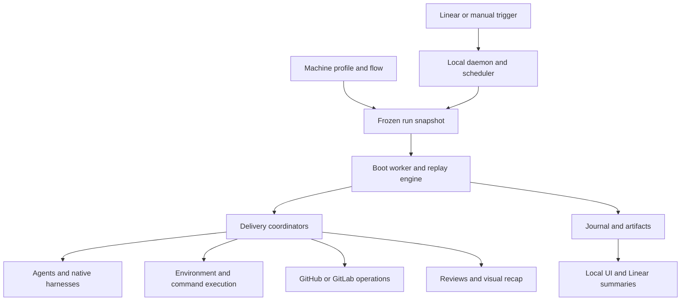
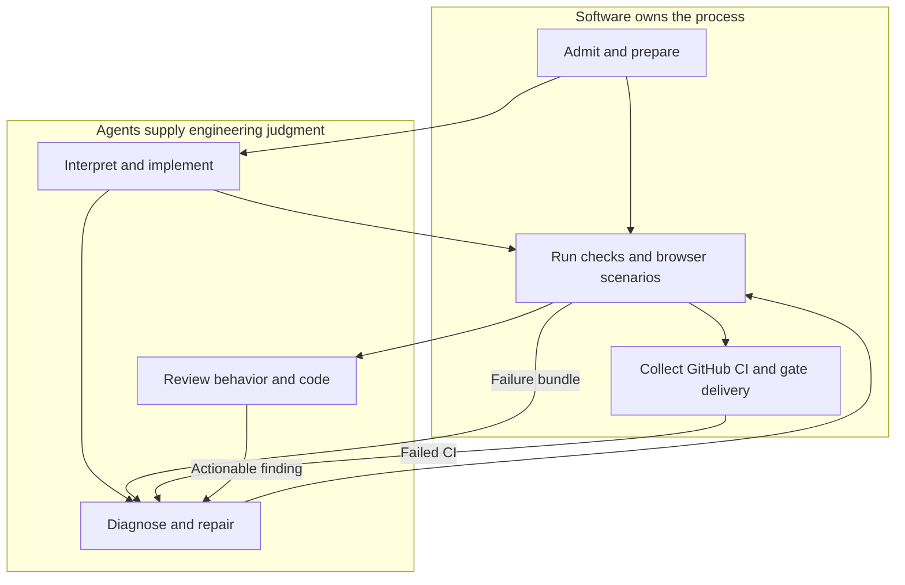
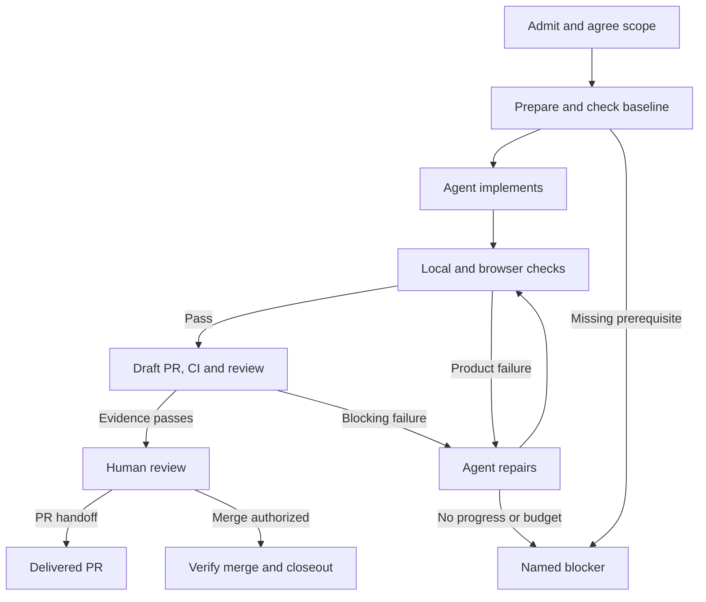
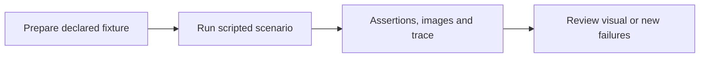
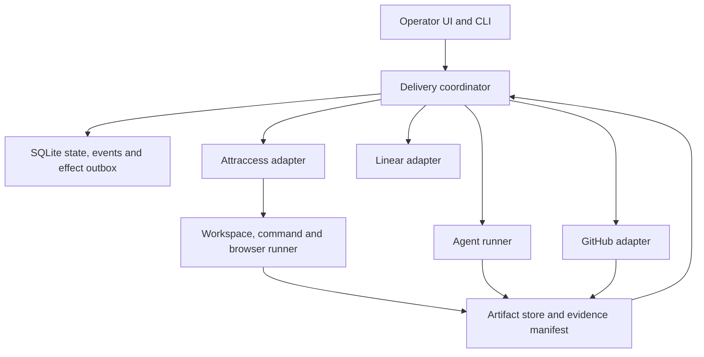

# Rocky, rebuilt around a working Attraccess delivery loop

> **Concept proposal · 27 September 2026**  
> Build a dependable Attraccess developer first. Extract a reusable software factory from proven behavior later.

## 1. The decision in one minute

Rocky demonstrated useful pieces: agents produce changes, draft PRs exist, checks run, conversations survive interruptions, and journals explain what happened. It has **not demonstrated a reliable unattended coding delivery loop** in the retained runs.

The next project should have **one standard workflow implemented in ordinary typed code**, one supported repository, one agent harness, and a small set of tested environment and browser recipes. Keep AI for understanding a task, writing code, diagnosing failures, and judging usability. Use software for setup, test selection rules, browser execution, evidence bookkeeping, retries, and delivery.

The product promise: **delegate an eligible Attraccess issue and receive a reviewable, verified change—or a precise, bounded explanation of what prevents delivery.** A draft PR alone does not fulfill that promise.

| Build now | Preserve a seam for later | Defer |
| --- | --- | --- |
| Attraccess, GitHub, Linear, one standard pipeline | Repository adapter, tracker adapter, agent runner | Arbitrary repositories and multi-repository changes |
| Known environment and scripted browser scenarios | Environment recipes and scenario interface | AI discovery of setup on every run |
| Versioned workflow code and readable prompts | Workflow version boundary | Flow editor and user-defined node catalog |
| One active implementation, explicit recovery limits | Resource scheduler | High concurrency and multiple harnesses |
| Evidence-backed PR handoff and approved merge | Delivery policy | A multi-agent recap production pipeline |

This is a proposed new project. It deliberately narrows the earlier generic-product ambition; it does not silently change Rocky's existing runtime or repository rules.

## 2. What the audit actually found

The audit covers Rocky's package/subsystem inventory, production paths and contracts, shipped content, the effective local profile and frozen run workflows, retained journals, command surfaces, and unmerged PRs. It is an architectural and operational audit, **not a claim that every source line received a correctness review**.

At inspection, local `main` and remote `main` were `4c5577c`. One Rocky PR remained open: [#53, recovery fixes](https://github.com/JappyMondo/rocky/pull/53), head `4c597d6`, with green checks and review still required. Installed bundles contain mechanisms from that PR; their exact build commit is not embedded in the evidence inspected. The daemon was stopped. “Running” below describes retained state, not a live worker.

| Retained result | Runs | Interpretation |
| --- | ---: | --- |
| Exhausted | 17 | Workflow ended without delivery |
| Failed | 14 | Execution or integration failure |
| Cancelled | 2 | Stopped attempts |
| Running / queued / parked | 5 | Unfinished persisted records |
| Completed | 2 | One configuration probe; one no-code ticket conclusion |
| **Verified successful coding delivery** | **0** | Across this retained evidence set |

There are 40 retained runs: 39 Attraccess attempts across nine issues and one configuration probe. ATT-776 completed after the user confirmed that the old UI ticket needed no code change. Its earlier failures and human clarification also make it unsuitable as proof of unattended coding success. Eight coding issues have draft PRs still open. Repeated attempts are not independent benchmark tasks, and deleted history is outside this audit.

### The failures are broader than “AI is unreliable”

| Observed evidence | What it teaches us |
| --- | --- |
| ATT-764 repeatedly lost UI service readiness; PR #53 changes readiness during CI polling | A recorded successful check and a currently running service are different facts |
| ATT-777 hit unavailable fixtures, disk exhaustion, and unfinished browser/tool work | The platform must own environment, resource, and subprocess lifecycles |
| ATT-1079-5 reached passing CI, then exhausted with checks demanding real CC100 commissioning | Test scope must follow the change contract; hardware requirements need admission decisions |
| ATT-1098-4 reached passing CI, then exhausted on fresh-install and reader/device fixtures | A seeded admin account is not a complete UI test environment |
| ATT-920-3 recorded current-head CI passes, but a reviewer still said that CI evidence was missing | Evidence must reach the consumer as structured, authoritative input |
| ATT-893-3 retained a complaint about unsupported legacy plugin pages | Some blockers are genuine scope/architecture decisions, not infrastructure failures |
| ATT-1098 had Linear-effect and missing-adapter failures; ATT-1079 had inaccessible CI logs | Delivery integrations need reconciliation and partial-evidence handling |

**Inference:** excessive dynamism contributes strongly to the operational failures, but these records do not establish a causal percentage. Model choice, task size, product defects, changing runtime versions, and missing fixtures are confounders. The remedy must address all of them.

The [audit appendix](research/rocky-audit-2026-09-27.md) contains every retained run, configuration precedence, commands, PR findings, and source pointers.

## 3. What Rocky has become



The current graph is already mostly fixed delivery stages wrapped in a highly configurable framework. The shipped graph has **167 nodes**, including 31 agent attachment nodes; these are configuration nodes, not 167 sequential steps or 31 simultaneous agents. Models, prompts, tools, and MCP attachments account for most of its size.

The local Attraccess flow follows the same main control path: clarify → plan → implement/open draft → validate → acceptance → UI → code review → CI → recap → publish → approval → merge. Many failure routes return to validation. Recent code also checks CI within earlier review stages, so the diagram alone is not the whole execution policy.

One active profile configures 12 commands and one combined API/frontend service. Shipped review/CI caps are **5/3**; local automation overrides them to **25/15**. Setup and most checks can each run for 30 minutes. Increasing these budgets has not established completion.

### Keep the capability; reconsider the mechanism

| Capability worth keeping | Evidence and limit | Next mechanism |
| --- | --- | --- |
| Issue delegation and human steering | Real clarification and scope changes are recorded | Small durable inbox; separate clarification from approval |
| Isolated worktrees and branch adoption | Eight draft coding PRs demonstrate useful output | One workspace lease per task; preserve unpublished work |
| Typed agent results and tool boundaries | Useful contracts exist; unfinished-tool errors still occur | A small runner interface with explicit completion checks |
| Independent review and real checks | Real CI passes and real product findings exist | One bounded review with authoritative evidence |
| Journals, transcripts, screenshots | They make this audit possible | Durable state plus append-only events and artifact manifests |
| Revision-bound delivery and human approval | Existing code has checks; successful full merge path is unproven here | Mandatory current-revision gate, tested adversarially |
| Local UI, diffs, and operational controls | Substantial implemented product surface | A simpler operator console focused on decisions and blockers |
| Credential separation and filtered ingress | Valuable implemented boundaries | Preserve separation; expose only necessary endpoints |

Keep these as requirements and test cases. Reuse implementation only after checking its contract; none is automatically proven by its presence in Rocky.

## 4. Put AI where judgment is needed



| Question | Owner |
| --- | --- |
| What does this issue mean? Is it obsolete or ambiguous? | Agent, with a concise human question only when necessary |
| Which commands start Attraccess and seed a known role? | Versioned Attraccess adapter |
| Which existing checks are mandatory for these changed projects? | Rules using repository metadata, instructions, and CI configuration |
| Does a new behavior need a new test? | Agent proposes/authors it; independent acceptance review evaluates it |
| Can a user log in, save, reload, and see the persisted result? | Scripted browser assertions |
| Is this layout confusing or visually broken? | Agent or human judgment using captured states |
| Did a check pass, CI finish, or a PR merge? | Process result or platform API, never an agent summary |
| Should an unavailable physical device block this task? | Explicit task scope and delivery policy, decided before expensive work |

“Deterministic” means the steps and interpretation are defined. Browsers, networks, and builds still fail. Code must report timeouts, retain evidence, and use bounded recovery rather than pretending those systems are infallible.

## 5. One standard workflow



**Admission:** support one repository and one active implementation initially. Deduplicate issue events, honor cancellation and scope changes, check disk capacity and credentials, and record the release/version that will execute the run.

**Scope:** capture a small acceptance contract: required behavior, exclusions, affected surfaces, evidence needed, available fixture IDs, and delivery mode. An agent may propose this contract; rules reject unavailable mandatory capabilities. Changes to it are explicit revisions. New evidence can justify a new test, but a reviewer cannot silently expand a project-move ticket into a hardware-commissioning project.

**Baseline:** start from a recorded base SHA, run a small smoke check, and distinguish pre-existing failures. A baseline failure does not become the agent's unrelated repair project without a scope decision.

**Implementation:** start with one coding agent and one read-only reviewer. Fixing can resume the coding conversation with a structured failure bundle. The coordinator owns git publication, check execution, and tracker writes. Extra specialist roles require measured benefit.

**Verification:** local checks precede expensive review; after push, CI observation and review have independent state and budgets. Either can report useful failures. Review exhaustion must never prevent collection of CI evidence or the reserved CI repair attempt. Review evidence becomes stale after a relevant code change.

**Delivery:** produce a concise change explanation, acceptance results, screenshots where relevant, limitations, and PR link from recorded artifacts. A reporting outage should leave `report pending`, not rerun implementation. Publication receipts are tracked separately.

No-code conclusions remain a small explicit branch: establish the conclusion, publish it when authorized, verify the receipt, and label it `resolved without code`. They never inflate the coding-success metric.

## 6. The Attraccess adapter is the first real product

The adapter should use the repository's existing bootstrap, Nx projects, instructions, and CI. It should encode the knowledge once, and validate it on each run. Discovery becomes an onboarding and drift-detection activity rather than an open-ended agent job every time.

| Contract | Attraccess implementation direction |
| --- | --- |
| Workspace | Supported worktree/bootstrap scripts; record base/head and instruction digests |
| Toolchain | Read `.nvmrc`, package-manager pin, lockfile; verify actual binaries |
| Setup | `scripts/setup-dev-dependencies.sh`; explicit successful completion receipt |
| App services | `pnpm serve`; consume `.dev-serve-ports.json`; verify process ownership and actual API/frontend |
| Database | Run-owned storage; migrations; disposable scenario-specific seeds |
| Generated client | Run the repository's client generator when relevant; do not commit generated client code |
| Local checks | Derive affected Nx projects from a frozen comparison; execute the appropriate core/plugin/firmware commands |
| CI | Read actual workflows, required checks, branch protections, and merge queue state |
| Browser | Pinned Playwright runtime, fixture catalog, scripted authentication/navigation/assertions |
| Hardware | Separate simulated, compiled, and physical-device evidence; require explicit device availability |

Repository instructions remain authoritative. The inspected Attraccess instructions prohibit committed spec/plan files and generated API clients; keep task plans in the factory's run store. The adapter must also cover CI obligations beyond the current profile's basic Nx checks, including affected e2e, plugin packaging, and applicable repository-specific guards.

On drift, report the changed instruction/script/configuration and the missing adapter support. Do not ask AI to invent a replacement command and silently continue. A maintained adapter is a conscious cost of “it just works.”

### Browser setup is engineering, not a recurring conversation



The proposed Attraccess fixture catalog should include: fresh installation, administrator, ordinary member, denied-permission user, resource/group data, unenrolled 2FA account, and the relevant plugin enabled/disabled states. Define English/German and desktop/mobile coverage per changed surface. Authentication data stays private to the run.

Each scenario starts from reproducible conditions. One-time links and enrollment flows get fresh accounts; one scenario cannot consume another's state. A first-install test gets a fresh database, not the already-initialized shared admin environment. Plugin UI tests install the actual relevant plugin. Hardware simulations are labeled simulations.

An agent can author a missing Playwright scenario and use exploratory browsing to diagnose it. Once accepted, the runner executes the scenario without an LLM choosing each click. New tests must fail on the old behavior when applicable. Keep mandatory acceptance scenarios outside the implementation agent's writable scope; changes require separate review. The agent may propose new tests but cannot weaken the independent acceptance set to make a repair green.

A fixture failure and a product failure remain different outcomes. Failure to prepare a known authenticated fixture is a setup problem. If login or session persistence is itself under test, its failure is product evidence. An application error after verified login is also product evidence. HTTP 200 alone proves neither.

See the official Playwright guidance on [authentication and accounts](https://playwright.dev/docs/auth), [server lifecycle](https://playwright.dev/docs/test-webserver), and [traces](https://playwright.dev/docs/trace-viewer).

## 7. Make evidence a first-class input

**A claim is not a receipt.** Give every checker and reviewer the same structured facts, rather than expecting them to reconstruct a run from summaries or arbitrary workspace files.

| Receipt | Required identity and evidence | Becomes stale when |
| --- | --- | --- |
| Local check | Head/tree, base, command, toolchain, exit status, log artifact | Relevant inputs or command change |
| Browser scenario | Head, scenario/fixture version, role, locale, viewport, assertion result, trace/screenshots | Code or fixture inputs change |
| CI | PR head, integration/merge-group SHA where applicable, workflow/job/attempt, conclusion, logs or explicit log gap | Head/base/integration candidate changes or a new attempt supersedes it |
| Review | Head, scope version, stable findings and resolutions | Relevant diff or acceptance scope changes |
| Approval | Approver, approved head, scope, delivery action | Head/scope changes or approval is revoked |
| External effect | Stable operation key, intended payload, remote ID, confirmed state | Reconciliation contradicts the receipt |

Store full bounded logs as artifacts, with small diagnostic excerpts for agents. A timed-out command retains partial output. Missing CI logs leave a failed job plus `diagnostics unavailable`; they must not erase the failure or make the fixer unreachable.

For the first implementation, invalidate all relevant code checks after a code change. Optimize selective reuse only after correctness is established. Presentation-only retries can reuse valid code evidence. A restarted browser service needs new readiness, but polling GitHub should not require starting the application again.

The final gate is code: all mandatory criteria have valid evidence, no unresolved blocking finding exists, required checks/protections are satisfied, and delivery authority is valid. Distinguish a PR-head check from a merge queue's synthetic integration commit; record their relationship and honor the platform's required merge-group checks. A model cannot vote these conditions away.

## 8. Recovery needs limits and different outcomes

| Failure class | First response | Escalation |
| --- | --- | --- |
| Dependency/service/browser setup | One known recipe retry, collect logs and owned-process state | `blocked: environment` with failed prerequisite |
| Product test or CI failure | Coding agent gets exact failure bundle; rerun checks | `needs engineering` if unchanged failure repeats |
| Review finding | Stable finding ID, evidence, explicit resolution | One disagreement arbitration; human scope decision if unresolved |
| Transient external API | Backoff and reconcile existing effect | `waiting: external` with deadline and next attempt |
| Missing credentials or hardware | Stop dependent work before expensive implementation | `blocked: access` or `blocked: hardware` |
| Lost worker | Recover lease, inspect process/effect state, resume the recorded stage | `recovery required` if state cannot be reconciled |
| Resource pressure | Admission refuses/queues work; preserve unpublished changes | Operator-visible capacity requirement |

**Initial proposed budgets:** one environment retry, two product/CI repair attempts, one review correction and one disagreement decision, plus a total wall-time/token ceiling. CI repair has a protected allowance; no-op reviews cannot consume it. Calibrate these on the benchmark rather than copying the old 25/15 limits.

Count repeated failure signatures. If the same input, same head, and same finding recur without new evidence, escalate rather than reopening the entire validation loop. A flaky-test retry requires a recorded reason. Agents cannot raise limits or change required checks.

Long waits release execution capacity. The UI shows the next wake time and reason. Cancellation stops owned processes and further side effects, while reconciling effects already sent. Cleanup removes only disposable or safely published work and retains the evidence needed to understand failure.

## 9. Smaller architecture, explicit durable state



**Recommended starting point:** a TypeScript coordinator with explicit stage transitions, SQLite transactions, an append-only event history, and files for large artifacts. This is a proposal, not a claim that SQLite itself solves recovery. Transitions must use a single owner or fenced lease; agent sessions are children of run state, not the authority for it.

Avoid replaying arbitrary user workflow code from the top. Persist the current stage and its input identity. Before an external write, commit an outbox intent; after it, save a receipt. If the process dies between the write and receipt, reconcile by stable task/operation identity before retrying. External systems without idempotent writes still need duplicate detection; do not claim universal exactly-once execution.

Record workflow, adapter, prompt, runner, and build versions per run. A deployment does not silently change an in-flight workflow. Drain runs, keep the compatible worker, or perform a tested explicit state migration. Old Rocky journals remain archived evidence; the new project need not execute them. Resume old implementation work only through an explicit import that rereads the branch and PR and invalidates unproven receipts.

Suggested modules—not a new plugin framework:

```text
src/coordinator/       states, transitions, budgets, delivery gate
src/store/             transactions, leases, events, effect outbox
src/attraccess/        setup, checks, fixtures, repository policy
src/runner/            commands, process ownership, browser execution
src/agents/            one harness adapter and typed task contracts
src/integrations/      GitHub and Linear
src/evidence/          receipts, artifacts, report rendering
prompts/               implement.md and review.md
acceptance/            independent scenarios and injected failures
```

Do not build an extension registry yet. Small interfaces allow later extraction without asking the operator to configure each internal connection.

## 10. The right amount of configuration

| Operator configures | Maintainer changes in versioned code | Agents may propose, not silently change |
| --- | --- | --- |
| Credential references and bot identity | Workflow stages and transition rules | Acceptance criteria and task breakdown |
| Workspace/cache location and capacity | Attraccess setup and fixtures | A new test or missing fixture |
| Supported model selection and budgets | Mandatory check selection and evidence schemas | A product repair or harness improvement |
| PR-only or approval-gated merge policy | Recovery rules and adapter compatibility | A scope change requiring an explicit decision |
| Notification preferences | Browser runtime and tool permissions | A documented reason for a transient retry |

Keep one effective configuration view with provenance: “this value came from release X / operator setting Y.” Validate it before admission. Eliminate the current need to reason across embedded profile source, a flow sidecar, materialized settings, frozen snapshots, leftover TypeScript, and installed runtime patches.

## 11. What other factories suggest

These sources support design choices, not a promise of comparable reliability on Attraccess.

| System / source | Useful idea | Boundary |
| --- | --- | --- |
| [Stripe Minions](https://stripe.dev/blog/minions-stripes-one-shot-end-to-end-coding-agents-part-2) | Code-defined workflow mixes deterministic steps with bounded agent work; standardized environments | Internal production account, not a downloadable proven Attraccess solution |
| [OpenAI Symphony](https://github.com/openai/symphony/blob/main/SPEC.md) | Small coordinator, isolated task workspaces, readable workflow policy | Scheduling and agent handoff do not prove delivery |
| [OpenAI harness engineering](https://openai.com/index/harness-engineering/) | Invest in repository tooling, legible state, and enforced boundaries | Its autonomy depends on repository-specific investment |
| [Anthropic long-running harnesses](https://www.anthropic.com/engineering/effective-harnesses-for-long-running-agents) | Incremental tasks, explicit acceptance, durable progress, browser verification | Progress notes cannot establish that external operations succeeded |
| [StrongDM Software Factory](https://factory.strongdm.ai/) | Independent behavioral scenarios and controlled integration failures | Do not import its no-human-review philosophy or build every service replica |
| [OpenHands persistence](https://docs.openhands.dev/sdk/guides/convo-persistence) and [remote execution](https://docs.openhands.dev/sdk/guides/agent-server/overview) | Agent conversation state and execution infrastructure have distinct interfaces | Restored conversation does not restore services or validate a PR |
| [Temporal workflow semantics](https://docs.temporal.io/workflow-definition) | Explicit effects, deterministic orchestration, versioned histories | Operational cost and effect reconciliation still remain |

**Recommendation:** borrow the deterministic/agent split, environment investment, independent acceptance, and durable-effect discipline. Start without a new general workflow engine. Reconsider an engine if the small coordinator becomes a reliability burden, using the same crash and delivery tests to compare it.

The [research report](research/software-factory-patterns-2026-09-27.md) distinguishes first-party claims, public implementations, documented semantics, and proposed adaptations.

## 12. What the operator should see

The default page should answer four questions: **What is being changed? What has been verified? What is blocking it? What happens next?**

| Screen | Essential contents |
| --- | --- |
| Queue | Issue, eligibility, resource wait, current owner |
| Run | Small stage timeline, current activity, elapsed time/cost, next action |
| Evidence | Acceptance matrix with pass/fail/blocked/stale states and linked artifacts |
| Decision | Concise blocker or revision-specific review package; approve, steer, cancel |
| Operations | Installed build, adapter version, environment health, disk usage, worker state |

Keep raw transcripts behind a link. Use a read-only workflow diagram for orientation. “Queued,” “agent finished,” “ready for review,” “merge requested,” “merged,” and “Linear updated” must be visibly distinct. A stopped daemon must not make old `running` headers look alive.

## 13. Build order and proof of success

| Milestone | Build | Evidence required before expanding |
| --- | --- | --- |
| 1. Environment without agents | Attraccess checkout, setup, seeds, service owner, Playwright smoke | Ten clean setup/test/teardown cycles; no port or data cross-contamination |
| 2. One local coding loop | Scope contract, implementer, check runner, failure bundle | Small backend and UI changes satisfy independent acceptance |
| 3. GitHub delivery | Draft PR, current-head CI observation, bounded fixer, review | Deliberately failing CI reaches repair even after review budget exhaustion |
| 4. Durable operations | Transactional state, effect intents, recovery, cancellation | Kill before/after push, PR creation, receipt write; no duplicate delivery |
| 5. Human handoff and closeout | Clear evidence package, approved merge, Linear receipts | Changed head invalidates approval; merge and ticket state verified separately |
| 6. Modularity and throughput | Measured second worker, then second adapter if useful | Same acceptance corpus stays reliable; contention tests pass |

Build the core durability primitives early; milestone 4 is their full fault-injection qualification, not permission to postpone safe writes until then. Establish a vertical slice before polishing the operator console.

### A small, honest acceptance corpus

Use bounded tasks inspired by ATT-764 (copy/locale), ATT-777 (layout with 2FA state), ATT-842 (auth/permissions), plus one backend regression and one plugin packaging change. Large dashboard and firmware projects become later tests after decomposition and device/fixture readiness. Start new attempts from known baselines; do not count inherited repaired branches as fresh success.

Proposed promotion bar: **at least 8 of 10 predeclared eligible coding tasks reach verified PR handoff without operator repair**, all failures are accurately classified, and every mandatory crash/duplicate/stale-approval test passes. All merge tests retain the planned human approval gate. This is an initial local benchmark, not a statistically established universal success rate.

Report every admitted attempt and every admission rejection. Separately record completion rate, interventions excluding planned approval, repeated failure signatures, environment failure rate, elapsed time, model usage/cost when available, and artifacts missing at handoff. Never hide blocked runs by redefining eligibility afterward.

| Mandatory adversarial case | Required result |
| --- | --- |
| Wrong password, consumed 2FA state, already-initialized setup DB | Named fixture failure or reproducible reset; no fabricated UI pass |
| Browser timeout or service death | Retained trace/logs, owned-process cleanup, bounded recovery |
| Disk full, killed worker, competing launch | No lost unpublished work; correct lease recovery and admission behavior |
| Failed CI with unavailable logs | Failure stays visible; diagnostic gap and valid repair/escalation route |
| Reviewer disputes recorded CI | Same authoritative receipt reaches review; no endless no-op loop |
| Code changes after screenshot or approval | Old receipt invalidated before handoff/merge |
| API succeeds but response is lost | Reconcile existing object before retrying |
| New workflow release with old run | Compatible resume or declared migration boundary |

## 14. Starting the new project safely

Archive Rocky's source revisions, relevant PR diffs, profiles, run metadata, and selected failure artifacts as a reference corpus, with credentials excluded. Keep unfinished branches and PRs; the new system must not overwrite or discard them. Avoid two coordinators owning the same issue.

Do not port the flow editor, generic graph runtime, full SDK surface, all harnesses, or historical replay machinery into the new project by default. Port specific behavior only when a test explains why it is needed. Preserve the old app read-only for investigation if useful.

The first implementation decision is now concrete: **make an Attraccess workspace and browser scenario pass repeatedly without AI, then put one coding agent inside that reliable loop.** Choose the first eligible tasks and calibrate budgets from their evidence. The exact model and hosting substrate remain replaceable choices; neither should delay proving this delivery contract.
